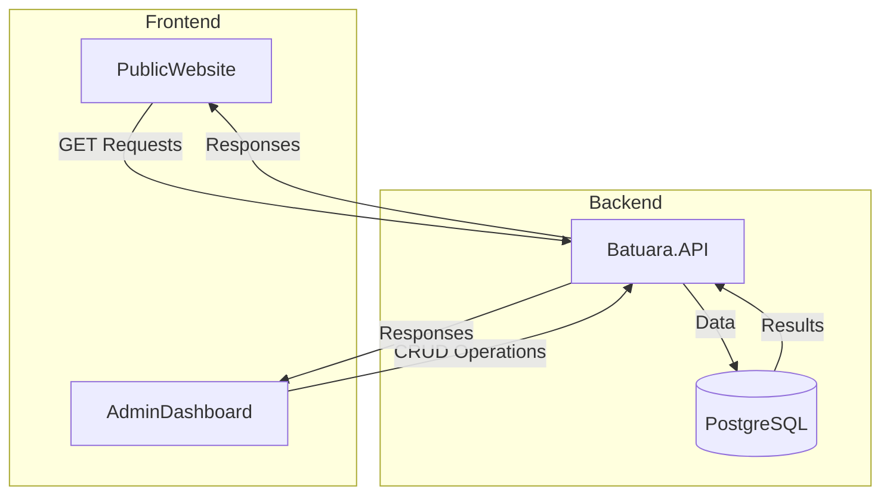

# Design Document

## Overview

Este documento detalha o design da solução para implementar a integração entre o backend (Batuara.API) e os frontends (PublicWebsite e AdminDashboard) do projeto Casa de Caridade Batuara. A solução proposta aborda tanto a integração técnica quanto as melhorias visuais específicas para o PublicWebsite, garantindo uma experiência de usuário coesa e representativa da identidade da Casa de Caridade Batuara.

## Arquitetura

A arquitetura da integração seguirá o padrão cliente-servidor com comunicação RESTful:



### Componentes Principais

1. **PublicWebsite**
   - Interface pública para visitantes
   - Principalmente operações de leitura (GET)
   - Melhorias visuais específicas (logo, contraste, imagens)

2. **AdminDashboard**
   - Interface administrativa
   - Operações CRUD completas
   - Sistema de autenticação integrado

3. **Batuara.API**
   - Backend .NET Core 8
   - Endpoints RESTful
   - Sistema de autenticação JWT
   - Validação e processamento de dados

4. **PostgreSQL**
   - Banco de dados relacional
   - Armazenamento persistente

## Componentes e Interfaces

### 1. Serviço de API (Frontend)

Implementaremos um serviço de API centralizado em ambos os frontends para gerenciar todas as comunicações com o backend:

```typescript
// src/services/api.ts
import axios from 'axios';

const API_BASE_URL = process.env.REACT_APP_API_URL || 'http://localhost:3003/api';

const api = axios.create({
  baseURL: API_BASE_URL,
  timeout: 10000,
  headers: {
    'Content-Type': 'application/json',
  },
});

// Interceptor para adicionar token de autenticação
api.interceptors.request.use(
  (config) => {
    const token = localStorage.getItem('token');
    if (token) {
      config.headers.Authorization = `Bearer ${token}`;
    }
    return config;
  },
  (error) => Promise.reject(error)
);

// Interceptor para tratamento de erros
api.interceptors.response.use(
  (response) => response,
  async (error) => {
    // Tratamento de erros específicos (401, 403, etc.)
    // Renovação automática de token expirado
    // Retry com backoff exponencial
    return Promise.reject(error);
  }
);

export default api;
```

### 2. Serviço de Autenticação (AdminDashboard)

```typescript
// src/services/auth.service.ts
import api from './api';

export interface LoginCredentials {
  email: string;
  password: string;
}

export interface AuthResponse {
  token: string;
  refreshToken: string;
  user: {
    id: string;
    name: string;
    email: string;
    role: string;
  };
}

const AuthService = {
  async login(credentials: LoginCredentials): Promise<AuthResponse> {
    const response = await api.post('/auth/login', credentials);
    this.setSession(response.data);
    return response.data;
  },

  async logout(): Promise<void> {
    await api.post('/auth/logout');
    this.clearSession();
  },

  async refreshToken(): Promise<AuthResponse> {
    const refreshToken = localStorage.getItem('refreshToken');
    const response = await api.post('/auth/refresh-token', { refreshToken });
    this.setSession(response.data);
    return response.data;
  },

  setSession(authData: AuthResponse): void {
    localStorage.setItem('token', authData.token);
    localStorage.setItem('refreshToken', authData.refreshToken);
    localStorage.setItem('user', JSON.stringify(authData.user));
  },

  clearSession(): void {
    localStorage.removeItem('token');
    localStorage.removeItem('refreshToken');
    localStorage.removeItem('user');
  },

  isAuthenticated(): boolean {
    return !!localStorage.getItem('token');
  },

  getUser(): any {
    const user = localStorage.getItem('user');
    return user ? JSON.parse(user) : null;
  }
};

export default AuthService;
```

### 3. Contexto de Autenticação (AdminDashboard)

```typescript
// src/contexts/AuthContext.tsx
import React, { createContext, useContext, useState, useEffect } from 'react';
import AuthService from '../services/auth.service';

interface AuthContextType {
  isAuthenticated: boolean;
  user: any;
  loading: boolean;
  login: (email: string, password: string) => Promise<void>;
  logout: () => Promise<void>;
}

const AuthContext = createContext<AuthContextType | undefined>(undefined);

export const AuthProvider: React.FC<{ children: React.ReactNode }> = ({ children }) => {
  const [isAuthenticated, setIsAuthenticated] = useState<boolean>(AuthService.isAuthenticated());
  const [user, setUser] = useState<any>(AuthService.getUser());
  const [loading, setLoading] = useState<boolean>(true);

  useEffect(() => {
    const checkAuth = async () => {
      try {
        if (isAuthenticated) {
          // Verificar se o token ainda é válido
          setUser(AuthService.getUser());
        }
      } catch (error) {
        await logout();
      } finally {
        setLoading(false);
      }
    };

    checkAuth();
  }, []);

  const login = async (email: string, password: string) => {
    setLoading(true);
    try {
      const response = await AuthService.login({ email, password });
      setIsAuthenticated(true);
      setUser(response.user);
    } finally {
      setLoading(false);
    }
  };

  const logout = async () => {
    setLoading(true);
    try {
      await AuthService.logout();
    } finally {
      setIsAuthenticated(false);
      setUser(null);
      setLoading(false);
    }
  };

  return (
    <AuthContext.Provider value={{ isAuthenticated, user, loading, login, logout }}>
      {children}
    </AuthContext.Provider>
  );
};

export const useAuth = () => {
  const context = useContext(AuthContext);
  if (context === undefined) {
    throw new Error('useAuth must be used within an AuthProvider');
  }
  return context;
};
```

### 4. Serviços de Dados (Ambos os Frontends)

Implementaremos serviços específicos para cada entidade do sistema:

```typescript
// src/services/events.service.ts
import api from './api';
import { Event } from '../types/Event';

const EventsService = {
  async getAll(params?: any): Promise<Event[]> {
    const response = await api.get('/events', { params });
    return response.data;
  },

  async getById(id: string): Promise<Event> {
    const response = await api.get(`/events/${id}`);
    return response.data;
  },

  async create(event: Partial<Event>): Promise<Event> {
    const response = await api.post('/events', event);
    return response.data;
  },

  async update(id: string, event: Partial<Event>): Promise<Event> {
    const response = await api.put(`/events/${id}`, event);
    return response.data;
  },

  async delete(id: string): Promise<void> {
    await api.delete(`/events/${id}`);
  }
};

export default EventsService;
```

Serviços similares serão implementados para outras entidades (Orixás, Linhas de Umbanda, Conteúdo Espiritual, etc.).

### 5. Melhorias Visuais do PublicWebsite

#### 5.1 Componente de Header com Logo e Frase

```tsx
// src/components/Header/Header.tsx
import React from 'react';
import { Box, Typography, Container } from '@mui/material';
import { styled } from '@mui/material/styles';
import logo from '../../assets/images/batuara_logo.png';

const HeaderContainer = styled(Box)(({ theme }) => ({
  backgroundImage: 'url(/assets/images/bg.jpg)',
  backgroundSize: 'cover',
  backgroundPosition: 'center',
  padding: theme.spacing(4, 0),
  textAlign: 'center',
  position: 'relative',
  '&::before': {
    content: '""',
    position: 'absolute',
    top: 0,
    left: 0,
    right: 0,
    bottom: 0,
    backgroundColor: 'rgba(0, 0, 0, 0.5)', // Overlay escuro para melhorar contraste
    zIndex: 1,
  },
}));

const LogoContainer = styled(Box)({
  position: 'relative',
  zIndex: 2,
  marginBottom: '1rem',
});

const StyledTypography = styled(Typography)(({ theme }) => ({
  position: 'relative',
  zIndex: 2,
  color: '#ffffff',
  textShadow: '2px 2px 4px rgba(0, 0, 0, 0.8)', // Sombra para melhorar legibilidade
  fontWeight: 600, // Texto mais forte
}));

const Header: React.FC = () => {
  return (
    <HeaderContainer>
      <Container maxWidth="lg">
        <LogoContainer>
          
        </LogoContainer>
        <StyledTypography variant="h4" component="h1" gutterBottom>
          Casa de Caridade Batuara
        </StyledTypography>
        <StyledTypography variant="h6" component="h2">
          Um lar espiritual dedicado à caridade, ao amor e à elevação da alma
        </StyledTypography>
      </Container>
    </HeaderContainer>
  );
};

export default Header;
```

#### 5.2 Configuração do Favicon

```typescript
// public/index.html (PublicWebsite)
<!DOCTYPE html>
<html lang="pt-BR">
  <head>
    <meta charset="utf-8" />
    <link rel="icon" href="%PUBLIC_URL%/favicon.ico" />
    <link rel="apple-touch-icon" href="%PUBLIC_URL%/logo192.png" />
    <!-- Outros meta tags -->
    <title>Casa de Caridade Batuara</title>
  </head>
  <body>
    <noscript>Você precisa habilitar JavaScript para executar este aplicativo.</noscript>
    <div id="root"></div>
  </body>
</html>
```

## Modelos de Dados

### Interfaces TypeScript para Entidades

```typescript
// src/types/Event.ts
export interface Event {
  id: string;
  title: string;
  description: string;
  date: string;
  time: string;
  location: string;
  imageUrl?: string;
  isPublic: boolean;
  createdAt: string;
  updatedAt: string;
}

// src/types/Orixa.ts
export interface Orixa {
  id: string;
  name: string;
  description: string;
  attributes: string[];
  colors: string[];
  elements: string[];
  day: string;
  imageUrl?: string;
  createdAt: string;
  updatedAt: string;
}

// Outras interfaces para diferentes entidades...
```

## Tratamento de Erros

### Estratégia de Tratamento de Erros

Implementaremos um sistema de tratamento de erros em camadas:

1. **Nível de API**: Interceptores Axios para tratamento de erros HTTP
2. **Nível de Serviço**: Tratamento específico por tipo de operação
3. **Nível de UI**: Componentes de feedback visual (toasts, alertas, etc.)

```typescript
// src/utils/errorHandler.ts
import { AxiosError } from 'axios';

export interface ApiError {
  status: number;
  message: string;
  details?: string;
}

export const handleApiError = (error: AxiosError): ApiError => {
  if (error.response) {
    // Erro com resposta do servidor
    const status = error.response.status;
    const data = error.response.data as any;
    
    return {
      status,
      message: data.message || getDefaultErrorMessage(status),
      details: data.details || error.message,
    };
  } else if (error.request) {
    // Erro sem resposta (problema de rede)
    return {
      status: 0,
      message: 'Erro de conexão',
      details: 'Não foi possível conectar ao servidor. Verifique sua conexão.',
    };
  } else {
    // Erro na configuração da requisição
    return {
      status: 0,
      message: 'Erro na requisição',
      details: error.message,
    };
  }
};

const getDefaultErrorMessage = (status: number): string => {
  switch (status) {
    case 400: return 'Requisição inválida';
    case 401: return 'Não autorizado';
    case 403: return 'Acesso negado';
    case 404: return 'Recurso não encontrado';
    case 500: return 'Erro interno do servidor';
    default: return 'Ocorreu um erro inesperado';
  }
};
```

### Componente de Notificação

```tsx
// src/components/Notification/Notification.tsx
import React from 'react';
import { Snackbar, Alert, AlertProps } from '@mui/material';

interface NotificationProps {
  open: boolean;
  message: string;
  severity: AlertProps['severity'];
  onClose: () => void;
  autoHideDuration?: number;
}

const Notification: React.FC<NotificationProps> = ({
  open,
  message,
  severity,
  onClose,
  autoHideDuration = 6000,
}) => {
  return (
    <Snackbar
      open={open}
      autoHideDuration={autoHideDuration}
      onClose={onClose}
      anchorOrigin={{ vertical: 'bottom', horizontal: 'center' }}
    >
      <Alert onClose={onClose} severity={severity} sx={{ width: '100%' }}>
        {message}
      </Alert>
    </Snackbar>
  );
};

export default Notification;
```

## Estratégia de Testes

### Testes de Integração

Implementaremos testes de integração para verificar a comunicação entre frontend e backend:

```typescript
// src/__tests__/integration/auth.test.ts
import axios from 'axios';
import AuthService from '../../services/auth.service';

// Mock do axios
jest.mock('axios');
const mockedAxios = axios as jest.Mocked<typeof axios>;

describe('Auth Service Integration', () => {
  beforeEach(() => {
    localStorage.clear();
    jest.clearAllMocks();
  });

  test('login should store tokens and user data', async () => {
    // Mock da resposta da API
    const mockResponse = {
      data: {
        token: 'fake-token',
        refreshToken: 'fake-refresh-token',
        user: {
          id: '1',
          name: 'Admin',
          email: 'admin@casabatuara.org.br',
          role: 'Admin',
        },
      },
    };

    mockedAxios.post.mockResolvedValueOnce(mockResponse);

    // Executar login
    await AuthService.login({ email: 'admin@casabatuara.org.br', password: 'password' });

    // Verificar se os tokens foram armazenados
    expect(localStorage.getItem('token')).toBe('fake-token');
    expect(localStorage.getItem('refreshToken')).toBe('fake-refresh-token');
    expect(localStorage.getItem('user')).toBe(JSON.stringify(mockResponse.data.user));
  });

  // Outros testes...
});
```

### Testes de Componentes

```typescript
// src/__tests__/components/Header.test.tsx
import React from 'react';
import { render, screen } from '@testing-library/react';
import Header from '../../components/Header/Header';

describe('Header Component', () => {
  test('renders logo and main text', () => {
    render(<Header />);
    
    // Verificar se o logo está presente
    const logoElement = screen.getByAltText('Casa de Caridade Batuara');
    expect(logoElement).toBeInTheDocument();
    
    // Verificar se os textos estão presentes
    expect(screen.getByText('Casa de Caridade Batuara')).toBeInTheDocument();
    expect(screen.getByText('Um lar espiritual dedicado à caridade, ao amor e à elevação da alma')).toBeInTheDocument();
  });
});
```

## Decisões de Design

### 1. Estratégia de Comunicação com API

Optamos por utilizar o Axios como biblioteca de HTTP para comunicação com a API devido a:

- Interceptores para tratamento global de requisições e respostas
- Suporte a cancelamento de requisições
- Transformação automática de dados JSON
- Configuração de timeout e retry

### 2. Gerenciamento de Estado

Para o gerenciamento de estado, utilizaremos:

- **TanStack Query (React Query)** para estado de servidor e cache
- **Context API** para estado global da aplicação (autenticação, tema, etc.)
- **Estado local** para componentes isolados

Esta abordagem permite:
- Cache automático de dados da API
- Revalidação automática
- Gerenciamento de loading states
- Tratamento de erros consistente

### 3. Autenticação e Autorização

Implementaremos autenticação baseada em JWT com:

- Token JWT armazenado no localStorage
- Refresh token para renovação automática
- Interceptor para adicionar token em requisições
- Redirecionamento automático para login em caso de token inválido

### 4. Melhorias Visuais

Para as melhorias visuais do PublicWebsite, decidimos:

- Aumentar o contraste da frase principal com sombra de texto e overlay escuro
- Utilizar o logo original da Casa Batuara como favicon e elemento visual principal
- Incorporar as imagens de fundo do site antigo para manter a identidade visual
- Manter a paleta de cores baseada nos Orixás, com ênfase no azul de Yemanjá

## Considerações de Segurança

1. **Proteção contra XSS**
   - Sanitização de dados antes da renderização
   - Uso de React (que escapa HTML por padrão)
   - Content Security Policy (CSP)

2. **Proteção contra CSRF**
   - Tokens anti-CSRF em formulários
   - SameSite cookies

3. **Segurança de Autenticação**
   - Tokens JWT com tempo de expiração curto
   - Refresh tokens com rotação
   - Validação de tokens no servidor

4. **Proteção de Dados**
   - Transmissão via HTTPS
   - Minimização de dados sensíveis no cliente
   - Validação de dados no cliente e servidor

## Considerações de Performance

1. **Otimização de Carregamento**
   - Lazy loading de componentes e rotas
   - Code splitting
   - Compressão de imagens

2. **Otimização de Requisições**
   - Cache de dados com React Query
   - Debounce em pesquisas e filtros
   - Paginação de listas grandes

3. **Renderização Eficiente**
   - Memoização de componentes pesados
   - Virtualização de listas longas
   - Otimização de re-renderizações

## Considerações de Acessibilidade

1. **Contraste e Legibilidade**
   - Aumento do contraste da frase principal
   - Tamanhos de fonte adequados
   - Cores com contraste suficiente

2. **Navegação por Teclado**
   - Foco visível em elementos interativos
   - Ordem de tabulação lógica
   - Atalhos de teclado para ações comuns

3. **Compatibilidade com Leitores de Tela**
   - Textos alternativos para imagens
   - Landmarks ARIA
   - Hierarquia de cabeçalhos adequada

## Alternativas Consideradas

### 1. Redux vs. Context API + React Query

**Decisão:** Context API + React Query

**Razões:**
- Menor curva de aprendizado
- Menos boilerplate
- Gerenciamento automático de cache e revalidação
- Separação clara entre estado do servidor e estado da aplicação

### 2. Axios vs. Fetch API

**Decisão:** Axios

**Razões:**
- Interceptores para tratamento global de requisições
- Melhor tratamento de erros
- Cancelamento de requisições
- Transformação automática de dados

### 3. Material-UI vs. Tailwind CSS

**Decisão:** Manter Material-UI (já em uso)

**Razões:**
- Já implementado no projeto
- Componentes prontos e personalizáveis
- Tema consistente
- Suporte a acessibilidade

## Plano de Implementação

A implementação será dividida em fases:

1. **Fase 1: Configuração Básica**
   - Configuração do serviço de API
   - Implementação de interceptores
   - Configuração de variáveis de ambiente

2. **Fase 2: Autenticação**
   - Implementação do serviço de autenticação
   - Contexto de autenticação
   - Rotas protegidas

3. **Fase 3: Serviços de Dados**
   - Implementação dos serviços para cada entidade
   - Integração com React Query
   - Tratamento de erros

4. **Fase 4: Melhorias Visuais**
   - Implementação do novo header com logo
   - Configuração do favicon
   - Ajustes de contraste e legibilidade

5. **Fase 5: Testes e Refinamento**
   - Testes de integração
   - Testes de componentes
   - Ajustes finais