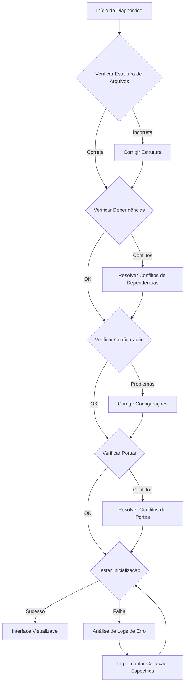

# Design Document

## Overview

Este documento detalha o design da solução para resolver os problemas de visualização das interfaces frontend do projeto Casa de Caridade Batuara. A solução proposta aborda os problemas de inicialização dos servidores React para o site público (PublicWebsite) e o dashboard administrativo (AdminDashboard), permitindo que as interfaces sejam visualizadas e avaliadas corretamente.

## Arquitetura

A arquitetura atual do frontend consiste em dois projetos React independentes:

1. **PublicWebsite** - Site público com 9 seções principais
2. **AdminDashboard** - Interface administrativa com sistema de autenticação e gerenciamento

Ambos os projetos utilizam:
- React 18
- TypeScript
- Material-UI v5
- React Router v6
- TanStack Query (React Query)
- React Hook Form

A solução proposta não altera a arquitetura existente, mas resolve os problemas de configuração e dependências que impedem a inicialização correta dos servidores de desenvolvimento.

## Componentes e Interfaces

### Diagnóstico e Solução de Problemas

Para diagnosticar e resolver os problemas de inicialização, implementaremos um processo sistemático:

1. **Verificação de Dependências**
   - Análise do package.json para identificar conflitos de versões
   - Verificação de compatibilidade entre dependências
   - Resolução de conflitos mantendo a funcionalidade existente

2. **Verificação de Configuração**
   - Análise dos arquivos de configuração (webpack, babel, etc.)
   - Verificação de variáveis de ambiente necessárias
   - Correção de configurações incorretas

3. **Verificação de Portas**
   - Identificação de conflitos de portas
   - Implementação de detecção e resolução automática de conflitos de portas

4. **Verificação de Scripts**
   - Análise dos scripts npm definidos no package.json
   - Correção ou adição de scripts necessários

### Fluxo de Diagnóstico



## Modelos de Dados

Não há alterações nos modelos de dados existentes, pois este design foca na resolução de problemas de configuração e inicialização.

## Tratamento de Erros

### Estratégia de Logging

Implementaremos um sistema de logging aprimorado para capturar erros durante a inicialização:

1. **Logs de Inicialização**
   - Captura detalhada do processo de inicialização
   - Identificação clara de pontos de falha

2. **Logs de Dependências**
   - Registro de conflitos de dependências
   - Registro de versões incompatíveis

3. **Logs de Configuração**
   - Registro de problemas de configuração
   - Registro de variáveis de ambiente ausentes ou incorretas

### Mensagens de Erro

As mensagens de erro serão aprimoradas para fornecer informações claras e acionáveis:

1. **Formato de Mensagem**
   ```
   [ERRO] [Categoria] Descrição do erro
   Causa: Causa provável do erro
   Solução: Passos sugeridos para resolver o problema
   ```

2. **Categorias de Erro**
   - DEPENDÊNCIA: Problemas relacionados a dependências
   - CONFIGURAÇÃO: Problemas relacionados a configurações
   - PORTA: Problemas relacionados a conflitos de portas
   - AMBIENTE: Problemas relacionados ao ambiente de desenvolvimento

## Estratégia de Testes

### Testes de Inicialização

1. **Teste de Inicialização do PublicWebsite**
   - Verificar se o servidor inicia corretamente
   - Verificar se a interface é acessível em http://localhost:3000
   - Verificar se todas as seções são renderizadas corretamente

2. **Teste de Inicialização do AdminDashboard**
   - Verificar se o servidor inicia corretamente
   - Verificar se a interface é acessível em http://localhost:3001
   - Verificar se todas as páginas são acessíveis através do menu

### Testes de Compatibilidade

1. **Teste de Compatibilidade de Dependências**
   - Verificar se todas as dependências são compatíveis entre si
   - Verificar se as dependências são compatíveis com o ambiente de desenvolvimento

2. **Teste de Compatibilidade de Ambiente**
   - Verificar se o ambiente de desenvolvimento atende aos requisitos
   - Verificar se todas as variáveis de ambiente necessárias estão definidas

## Decisões de Design

### Abordagem de Resolução

Optamos por uma abordagem sistemática de diagnóstico e resolução, em vez de simplesmente reinstalar todas as dependências ou recriar os projetos. Isso permite:

1. **Identificação da Causa Raiz**
   - Entender o que causou o problema
   - Evitar que o problema ocorra novamente

2. **Documentação do Processo**
   - Criar um guia para resolução de problemas semelhantes
   - Facilitar a manutenção futura

3. **Preservação do Código Existente**
   - Manter todo o trabalho já realizado
   - Evitar a necessidade de reimplementar funcionalidades

### Ferramentas de Diagnóstico

Utilizaremos as seguintes ferramentas para diagnóstico:

1. **npm-check** - Para verificar dependências desatualizadas ou conflitantes
2. **why-is-node-running** - Para identificar processos Node.js que podem estar bloqueando portas
3. **react-error-overlay** - Para capturar e exibir erros de compilação de forma mais clara

### Scripts de Automação

Criaremos scripts de automação para facilitar o diagnóstico e a resolução de problemas:

1. **check-deps.js** - Verifica dependências e identifica conflitos
2. **check-ports.js** - Verifica se as portas necessárias estão disponíveis
3. **fix-common-issues.js** - Resolve problemas comuns automaticamente

## Considerações de Segurança

Não há considerações de segurança significativas para esta solução, pois estamos focando em problemas de configuração e inicialização em um ambiente de desenvolvimento local.

## Considerações de Performance

A resolução dos problemas de inicialização pode melhorar o tempo de inicialização dos servidores de desenvolvimento, mas não há considerações de performance significativas para esta solução específica.

## Considerações de Escalabilidade

A solução proposta é focada no ambiente de desenvolvimento local e não tem impacto direto na escalabilidade do sistema em produção.

## Considerações de Manutenção

A documentação clara do processo de diagnóstico e resolução facilitará a manutenção futura e a resolução de problemas semelhantes.

## Alternativas Consideradas

### Alternativa 1: Recriar os Projetos Frontend

**Prós:**
- Garantiria uma configuração limpa
- Eliminaria problemas de configuração legados

**Contras:**
- Perda potencial de código e configurações personalizadas
- Tempo significativo para recriar e configurar os projetos
- Não resolveria a causa raiz dos problemas

### Alternativa 2: Usar Docker para Desenvolvimento

**Prós:**
- Ambiente de desenvolvimento consistente
- Isolamento de dependências
- Facilidade de configuração

**Contras:**
- Curva de aprendizado para desenvolvedores não familiarizados com Docker
- Overhead de recursos
- Tempo para configurar corretamente

### Decisão Final

Optamos pela abordagem sistemática de diagnóstico e resolução por ser mais eficiente, educativa e menos disruptiva para o código existente. Esta abordagem também cria um processo documentado que pode ser utilizado para resolver problemas semelhantes no futuro.