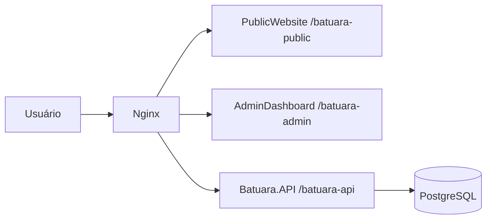

# Batuara.net — Guia de Onboarding para IA e Desenvolvedores

**Versão do documento:** 2026.04.03  
**Objetivo:** oferecer contexto suficiente para uma IA ou novo desenvolvedor entender rapidamente a estrutura, os módulos, o fluxo de deploy e os pontos de atenção do projeto.

## 1. Visão Geral

O Batuara.net é uma plataforma web da Casa de Caridade Caboclo Batuara composta por:

- **PublicWebsite** — portal público institucional
- **AdminDashboard** — painel administrativo para gestão editorial e operacional
- **Batuara.API** — API REST em .NET 8
- **PostgreSQL** — persistência relacional
- **Nginx** — reverse proxy e publicação local/produtiva

## 2. Arquitetura de Alto Nível



### 2.1 Regras arquiteturais importantes

- A API usa **PathBase `/batuara-api`**
- Os frontends operam como SPA servidas por Nginx
- O AdminDashboard consome rotas administrativas em `/batuara-api/api/*`
- O PublicWebsite consome rotas públicas em `/batuara-api/api/public/*`
- `SiteSettings` é o núcleo institucional compartilhado entre AdminDashboard e PublicWebsite

## 3. Estrutura do Repositório

```text
Batuara.net/
├── src/
│   ├── Backend/
│   │   ├── Batuara.API/
│   │   ├── Batuara.Application/
│   │   ├── Batuara.Domain/
│   │   ├── Batuara.Infrastructure/
│   │   ├── Batuara.Infrastructure.Tests/
│   │   └── Batuara.Auth/
│   └── Frontend/
│       ├── PublicWebsite/
│       └── AdminDashboard/
├── docs/
├── nginx/
├── scripts/
├── docker-compose.local.yml
├── docker-compose.production.yml
├── Dockerfile.api
└── Dockerfile.frontend
```

## 4. Stack e Versões Relevantes

### 4.1 Frontend

- React 19
- TypeScript 6
- Material UI 7
- TanStack Query 5
- Axios
- date-fns 4

### 4.2 Backend

- .NET 8
- ASP.NET Core 8
- Entity Framework Core 8
- PostgreSQL
- Serilog
- FluentValidation

## 5. Módulos Funcionais Atuais

### 5.1 API / Auth

- login
- refresh token
- logout
- verificação de sessão
- perfil do usuário
- alteração de senha

### 5.2 Conteúdo e CMS

- `SiteSettings`
  - história institucional
  - missão
  - contato
  - localização
  - mapa
  - redes sociais
  - PIX / dados bancários
- Eventos
- Calendário
- Orixás
- Guias e Entidades
- Linhas da Umbanda
- Conteúdos Espirituais
- Filhos da Casa

### 5.3 Ajustes recentes importantes

- **Nossa História**
  - editor em tela cheia
  - sem preview dividido
  - sem imagem e vídeo
  - sem botão `Link`
- **Localização**
  - fonte única: `site-settings/public`
- **Calendário público**
  - sem badge numérico diário
- **Operação local**
  - `nginx` pode exigir recriação após rebuilds completos

## 6. Endpoints de Referência

### 6.1 Endpoints operacionais

- `GET /batuara-api/health`
- `GET /batuara-api/swagger`

### 6.2 Endpoints de autenticação

- `POST /batuara-api/api/auth/login`
- `POST /batuara-api/api/auth/refresh`
- `POST /batuara-api/api/auth/logout`
- `GET /batuara-api/api/auth/me`
- `PUT /batuara-api/api/auth/change-password`

### 6.3 Endpoints institucionais

- `GET /batuara-api/api/site-settings/public`
- `GET /batuara-api/api/site-settings`
- `PUT /batuara-api/api/site-settings`

## 7. Banco de Dados e Migrations

### 7.1 Entidades centrais

- `User`
- `RefreshToken`
- `SiteSettings`
- `Event`
- `CalendarAttendance`
- `Orixa`
- `Guide`
- `UmbandaLine`
- `SpiritualContent`
- `HouseMember`
- `ContactMessage`

### 7.2 Migrations que explicam o estado atual

- `20260401234426_AddSiteSettings`
- `20260402235355_ContentManagementModules`
- `20260403014603_AddHistoryMissionTextToSiteSettings`
- `20260403043437_RemoveHistoryMediaFromSiteSettings`

## 8. Setup Local

### 8.1 Pré-requisitos

- Docker Desktop
- Node.js
- .NET 8 SDK

### 8.2 Variáveis obrigatórias

- `DB_PASSWORD`
- `JWT_SECRET`

### 8.3 Subir stack local

```bash
$env:DB_PASSWORD='<DB_PASSWORD>'
$env:JWT_SECRET='<JWT_SECRET>'
docker compose -p batuara-net-local -f docker-compose.local.yml up -d --build api publicwebsite admindashboard nginx
```

### 8.4 URLs locais

- PublicWebsite: `http://localhost/batuara-public/`
- AdminDashboard: `http://localhost/batuara-admin/`
- Swagger: `http://localhost/batuara-api/swagger`
- Health: `http://localhost/batuara-api/health`

### 8.5 Credencial local de referência

- e-mail: `admin@batuara.org.br`
- senha: `<USE_LOCAL_CREDENTIAL>`

## 9. Troubleshooting

### 9.1 Sintoma: API aparentemente “healthy”, mas o navegador retorna 502

Isso normalmente indica que o `nginx` local manteve upstreams antigos após recriação dos containers.

**Correção operacional:**

```bash
$env:DB_PASSWORD='<DB_PASSWORD>'
$env:JWT_SECRET='<JWT_SECRET>'
docker compose -p batuara-net-local -f docker-compose.local.yml up -d --force-recreate nginx
```

### 9.2 Sintoma: mudanças manuais não aparecem no browser

- executar rebuild com `--build`
- fazer hard refresh com `Ctrl+Shift+R`

## 10. Como Contribuir

### 10.1 Regra prática para mudanças

Se você alterar:

- **DTOs / requests / responses** → revisar frontend e Swagger
- **`SiteSettings`** → revisar AdminDashboard, PublicWebsite, validators, service e migrations
- **rotas** → revisar Nginx, documentação e clientes Axios
- **deploy local** → validar health, swagger, publicwebsite e login

### 10.2 Checklist mínimo

- rodar `dotnet build`
- rodar `dotnet test`
- rodar `npm run build` no frontend alterado
- validar no navegador quando houver impacto visual
- atualizar documentação em `docs/` quando a mudança for estrutural

## 11. Documentação Relacionada

- `docs/EFT-especificacao-funcional-tecnica.md`
- `docs/Resumo-Executivo.md`
- `docs/Backlog-Executavel.md`
- `docs/STATUS-PROJETO.md`
- `docs/TASK_HISTORY.md`
- `docs/DEPLOY.md`
- `docs/LOCAL_DEVELOPMENT_SETUP.md`

## 12. Change Log

### 2026.04.03

- Atualizado para refletir React 19 / MUI 7 / API .NET 8 atual
- Registradas mudanças recentes em `SiteSettings` e Nossa História
- Incluído procedimento de troubleshooting do `nginx` local
- Ajustadas URLs, setup, módulos reais e rotas de referência
