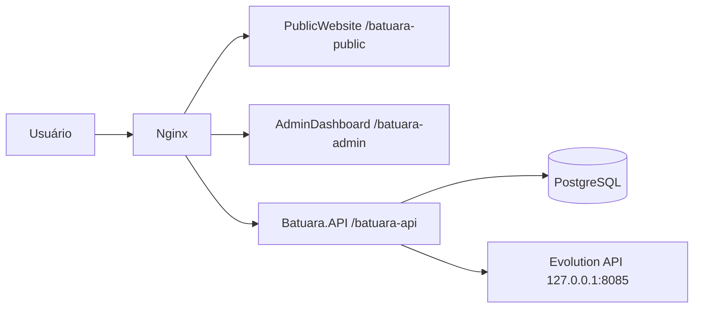

# Batuara.net — Guia de Onboarding para IA e Desenvolvedores

**Versão do documento:** 2026.07.08
**Objetivo:** oferecer contexto suficiente para uma IA ou novo desenvolvedor entender rapidamente a estrutura, os módulos, o fluxo de deploy e os pontos de atenção do projeto.

## 1. Visão Geral

O Batuara.net é uma plataforma web da Casa de Caridade Caboclo Batuara composta por:

- **PublicWebsite** — portal público institucional
- **AdminDashboard** — painel administrativo para gestão editorial e operacional
- **Batuara.API** — API REST em .NET 8
- **PostgreSQL** — persistência relacional
- **Nginx** — reverse proxy e publicação local/produtiva
- **Evolution API** — envio WhatsApp self-hosted na OCI para login de Filhos da Casa, lembretes de contribuição e respostas a contatos públicos

## 2. Arquitetura de Alto Nível



### 2.1 Regras arquiteturais importantes

- A API usa **PathBase `/batuara-api`**
- Os frontends operam como SPA servidas por Nginx
- O AdminDashboard consome rotas administrativas em `/batuara-api/api/*`
- O PublicWebsite consome rotas públicas em `/batuara-api/api/public/*`
- `SiteSettings` é o núcleo institucional compartilhado entre AdminDashboard e PublicWebsite
- A Evolution API na OCI não é pública; escuta somente em `127.0.0.1:8085`
- O Manager da Evolution só deve ser acessado por túnel SSH, nunca por porta pública
- A OCI deve expor publicamente apenas `80/tcp`, `443/tcp` e `22/tcp`; os demais serviços devem ser acessados via Nginx reverse proxy ou rede Docker interna

## 3. Estrutura do Repositório

```text
Batuara.net/
├── src/
│   ├── Backend/
│   │   ├── Batuara.API/
│   │   ├── Batuara.Application/
│   │   ├── Batuara.Domain/
│   │   ├── Batuara.Infrastructure/
│   │   ├── Batuara.Infrastructure.Tests/
│   │   └── Batuara.Auth/
│   └── Frontend/
│       ├── PublicWebsite/
│       └── AdminDashboard/
├── docs/
├── nginx/
├── scripts/
├── docker-compose.local.yml
├── docker-compose.production.yml
├── scripts/docker/docker-compose.whatsapp.yml
├── Dockerfile.api
└── Dockerfile.frontend
```

## 4. Stack e Versões Relevantes

### 4.1 Frontend

- React 19
- TypeScript 6
- Material UI 7
- TanStack Query 5
- Axios
- date-fns 4

### 4.2 Backend

- .NET 8
- ASP.NET Core 8
- Entity Framework Core 8
- PostgreSQL
- Serilog
- FluentValidation

## 5. Módulos Funcionais Atuais

### 5.1 API / Auth

- login
- refresh token
- logout
- verificação de sessão
- perfil do usuário
- alteração de senha
- RBAC/multiadmin com roles `Admin=1`, `Editor=2`, `Viewer=3`, `Member=4`
- login de Filho da Casa por WhatsApp
- lembretes reais de contribuição por WhatsApp, com throttling e opt-in
- resposta por WhatsApp para mensagens públicas quando o visitante autorizar

### 5.2 Conteúdo e CMS

- `SiteSettings`
  - história institucional
  - missão
  - contato
  - localização
  - mapa
  - redes sociais
  - PIX / dados bancários
- Eventos
- Calendário
- Orixás
- Guias e Entidades
- Linhas da Umbanda
- Conteúdos Espirituais
- Filhos da Casa

### 5.3 WhatsApp e Filho da Casa

- Evolution API self-hosted na OCI.
- Instância definitiva: `batuara-casa`.
- Estado validado em 2026-07-08: conectada (`state=open`) e enviando mensagens reais.
- Mensagens recebidas com sucesso em `5511975747470` e `5511995384032`.
- Número atual é temporário: `5511975747470`; trocar por chip dedicado da Casa quando disponível.
- API/Manager escutam apenas em `127.0.0.1:8085` na VM OCI.
- Para administrar o Manager, usar túnel SSH local e acessar `http://127.0.0.1:18085/manager/`.
- Runbook específico: `docs/Evolution API - Operacao OCI.md`.
- Backend também usa WhatsApp para códigos de login, lembretes de contribuição autorizados e resposta administrativa a mensagens públicas com opt-in.
- `ContributionReminders.Enabled` fica `false` por padrão; ativar explicitamente em produção após revisão operacional.

### 5.4 Ajustes recentes importantes

- **Nossa História**
  - editor em tela cheia
  - sem preview dividido
  - sem imagem e vídeo
  - sem botão `Link`
- **Localização**
  - fonte única: `site-settings/public`
- **Calendário público**
  - sem badge numérico diário
- **Operação local**
  - `nginx` pode exigir recriação após rebuilds completos
- **Dados religiosos / CMS**
  - Na Casa Batuara, `Exu` e `Pomba Gira` são tratados como Guias/Entidades, não como Orixás.
  - Em 2026-07-08, a produção foi ajustada diretamente no banco: removidos de `batuara."Orixas"` e inseridos em `batuara."Guides"`.
  - Banco local de desenvolvimento foi sincronizado a partir da produção após essa manutenção.
- **Hardening OCI**
  - Regras públicas extras no painel OCI foram removidas; manter somente `22`, `80` e `443`.
  - Como o usuário usa Vivo Fibra sem IP fixo, `22/tcp` permanece público por necessidade operacional; manter SSH por chave e sem login root/senha.

## 6. Endpoints de Referência

### 6.1 Endpoints operacionais

- `GET /batuara-api/health`
- `GET /batuara-api/swagger`

### 6.2 Endpoints de autenticação

- `POST /batuara-api/api/auth/login`
- `POST /batuara-api/api/auth/refresh`
- `POST /batuara-api/api/auth/logout`
- `GET /batuara-api/api/auth/me`
- `PUT /batuara-api/api/auth/change-password`

### 6.2.1 Endpoints de Filho da Casa

- `POST /batuara-api/api/member-auth/request-code`
- `POST /batuara-api/api/member-auth/verify-code`
- `GET /batuara-api/api/members/me`
- `PUT /batuara-api/api/members/me`
- `POST /batuara-api/api/members/me/contributions`

### 6.3 Endpoints institucionais

- `GET /batuara-api/api/site-settings/public`
- `GET /batuara-api/api/site-settings`
- `PUT /batuara-api/api/site-settings`

## 7. Banco de Dados e Migrations

### 7.1 Entidades centrais

- `User`
- `RefreshToken`
- `SiteSettings`
- `Event`
- `CalendarAttendance`
- `Orixa`
- `Guide`
- `UmbandaLine`
- `SpiritualContent`
- `HouseMember`
- `MemberLoginCode`
- `ContactMessage`
- `HouseMemberContribution`

### 7.2 Migrations que explicam o estado atual

- `20260401234426_AddSiteSettings`
- `20260402235355_ContentManagementModules`
- `20260403014603_AddHistoryMissionTextToSiteSettings`
- `20260403043437_RemoveHistoryMediaFromSiteSettings`
- `20260708020346_AddMemberLoginCodes`
- `20260708130000_AddRecurringContributionAndWhatsAppContact`

## 8. Setup Local

### 8.1 Pré-requisitos

- Docker Desktop
- Node.js
- .NET 8 SDK

### 8.2 Variáveis obrigatórias

- `DB_PASSWORD`
- `JWT_SECRET`

### 8.3 Subir stack local

```bash
$env:DB_PASSWORD='<DB_PASSWORD>'
$env:JWT_SECRET='<JWT_SECRET>'
docker compose -p batuara-net-local -f docker-compose.local.yml up -d --build api publicwebsite admindashboard nginx
```

### 8.4 URLs locais

- PublicWebsite: `http://localhost/batuara-public/`
- AdminDashboard: `http://localhost/batuara-admin/`
- Swagger: `http://localhost/batuara-api/swagger`
- Health: `http://localhost/batuara-api/health`

### 8.5 Credencial local de referência

- e-mail: `admin@batuara.org.br`
- senha: `<USE_LOCAL_CREDENTIAL>`

## 9. Troubleshooting

### 9.1 Sintoma: API aparentemente “healthy”, mas o navegador retorna 502

Isso normalmente indica que o `nginx` local manteve upstreams antigos após recriação dos containers.

**Correção operacional:**

```bash
$env:DB_PASSWORD='<DB_PASSWORD>'
$env:JWT_SECRET='<JWT_SECRET>'
docker compose -p batuara-net-local -f docker-compose.local.yml up -d --force-recreate nginx
```

### 9.2 Sintoma: mudanças manuais não aparecem no browser

- executar rebuild com `--build`
- fazer hard refresh com `Ctrl+Shift+R`

### 9.3 Sintoma: WhatsApp parou de enviar ou `batuara-casa` desconectou

- Validar `GET /instance/connectionState/batuara-casa` via Evolution API local da OCI.
- Se estiver `close` ou `401`, abrir túnel SSH para o Manager.
- Reconectar por QR Code usando WhatsApp em `Dispositivos conectados`.
- Confirmar que a API segue escutando somente em `127.0.0.1:8085`.
- Não abrir porta pública para a Evolution API.

## 10. Como Contribuir

### 10.1 Regra prática para mudanças

Se você alterar:

- **DTOs / requests / responses** → revisar frontend e Swagger
- **`SiteSettings`** → revisar AdminDashboard, PublicWebsite, validators, service e migrations
- **rotas** → revisar Nginx, documentação e clientes Axios
- **deploy local** → validar health, swagger, publicwebsite e login
- **WhatsApp/Evolution** → validar `batuara-casa`, envio real para números autorizados e atualizar `docs/Evolution API - Operacao OCI.md`
- **Contribuições recorrentes** → revisar `HouseMember`, `HouseMemberContribution`, `ContributionReminderProcessor`, migration/snapshot e AdminDashboard
- **Contato público com WhatsApp** → revisar PublicWebsite, `ContactMessageService`, validators, endpoint admin e opt-in do visitante

### 10.2 Checklist mínimo

- rodar `dotnet build`
- rodar `dotnet test`
- rodar `npm run build` no frontend alterado
- validar `docker compose -f "scripts/docker/docker-compose.production.yml" config --quiet` quando mexer em deploy
- validar `bash -n scripts/ci/deploy-rolling.sh scripts/ci/deploy-rolling-staging.sh` após mexer nos scripts
- validar no navegador quando houver impacto visual
- atualizar documentação em `docs/` quando a mudança for estrutural

### 10.3 Estado de Handoff Atual — 2026-07-08

Implementações/deploys concluídos e validados nesta sessão:

- RBAC/multiadmin, login WhatsApp e autosserviço de Filho da Casa.
- Evolution API self-hosted na OCI com instância `batuara-casa` conectada.
- Contribuições recorrentes com flags reais `IsRecurring` e `AllowWhatsAppReminder`.
- Geração automática da próxima mensalidade recorrente quando uma contribuição recorrente é marcada como paga.
- Processor/hosted service de lembretes por WhatsApp com limites conservadores e desativado por padrão.
- Resposta administrativa por WhatsApp para mensagens públicas autorizadas pelo visitante.
- Formulário público de contato com opt-in WhatsApp e telefone obrigatório quando opt-in estiver marcado.
- Deploy rolling preparado para ler `.env.whatsapp`, configurar WhatsApp via Docker network e aplicar migrations aditivas.
- Deploy em produção concluído em `master` nos commits `06a8d7a` e hotfix `c8c7c4e`; produção validada em `c8c7c4e`.
- Healthchecks de frontends corrigidos para usar `curl -fsS http://127.0.0.1:80`; `batuara-net-api`, `batuara-net-admin-dashboard` e `batuara-net-public-website` ficaram `healthy`.
- Banco de produção preservado após deploy; contagens críticas validadas.
- Manutenção de dados: `Exu` e `Pomba Gira` movidos de `Orixas` para `Guides` em produção, com backup prévio e sincronização do banco local a partir da produção.
- Evolution Manager/API validados sem acesso público; túnel local `127.0.0.1:18085` fechado.
- Painel OCI revisado pelo usuário; regras públicas extras removidas, mantendo apenas `22`, `80` e `443`.

Validações executadas:

- `docker run --rm -v "${PWD}:/src" -w /src mcr.microsoft.com/dotnet/sdk:8.0 dotnet test "Batuara.sln" -c Release` — passou com 33 testes.
- `docker run --rm -v "${PWD}:/src" -w /src mcr.microsoft.com/dotnet/sdk:8.0 dotnet build "src/Backend/Batuara.API/Batuara.API.csproj" -c Release` — passou.
- `npm run build` em `src/Frontend/AdminDashboard` — passou com warnings antigos.
- `npm run build` em `src/Frontend/PublicWebsite` — passou com warnings antigos.
- `docker compose -f "scripts/docker/docker-compose.production.yml" config --quiet` com envs dummy — passou.
- `bash -n scripts/ci/deploy-rolling.sh scripts/ci/deploy-rolling-staging.sh` via container SDK — passou.
- `docker compose -f "docker-compose.local.yml" build api admindashboard publicwebsite` — passou.
- `docker compose -f "docker-compose.local.yml" up -d api admindashboard publicwebsite` — serviços ficaram `healthy`.
- Produção OCI: commit `c8c7c4e`, API health `Healthy`, containers principais `healthy`.
- Produção OCI após manutenção religiosa: `Orixas=12`, `Guides=9`; `Exu` e `Pomba Gira` aparecem apenas em `Guides`.
- Banco local após sincronização OCI -> dev: `Orixas=12`, `Guides=9`; API local `healthy` pelo healthcheck do container.
- Acesso externo pós-hardening OCI: esperar somente `22`, `80` e `443`; revalidar com `Test-NetConnection` se houver nova alteração de regra.

Pendências operacionais para a próxima ferramenta/agente:

- Revisar `git status` e selecionar arquivos de commit com cuidado.
- Não commitar `.claude/`, `docs/.~lock.Plano de Testes Batuara.xlsx#` nem `scripts/output/`.
- Manter e versionar os artefatos de controle de testes aprovados: `docs/PlanoTestes.md` e `docs/Plano de Testes Batuara - v5.xlsx`.
- Revisar logs da Evolution API antes de produção.
- Manter `ContributionReminders.Enabled=false` até decisão explícita de ativação em produção.
- Trocar número temporário por chip dedicado da Casa quando disponível.
- Considerar restringir SSH com OCI Bastion/VPN no futuro; hoje `22` fica público porque o usuário não possui IP fixo.
- Revisar `ufw` e compose dos demais projetos para remover/bindar portas host em `127.0.0.1`; a barreira principal já foi ajustada no painel OCI.

## 11. Documentação Relacionada

- `docs/EFT-especificacao-funcional-tecnica.md`
- `docs/Resumo-Executivo.md`
- `docs/Backlog-Executavel.md`
- `docs/STATUS-PROJETO.md`
- `docs/Status Atual - RBAC WhatsApp e COR-09.md`
- `docs/Evolution API - Operacao OCI.md`
- `docs/Plano de Implementacao - RBAC e Login WhatsApp.md`
- `docs/TASK_HISTORY.md`
- `docs/DEPLOY.md`
- `docs/LOCAL_DEVELOPMENT_SETUP.md`

## 12. Change Log

### 2026.07.08

- Atualizado onboarding com Evolution API OCI, `batuara-casa`, RBAC/multiadmin e login WhatsApp de Filho da Casa.
- Registrado que o Manager da Evolution não tem acesso remoto público e deve ser acessado somente por túnel SSH.
- Incluídos endpoints e migration de `MemberLoginCodes`.
- Registrado handoff com contribuições recorrentes, lembretes WhatsApp, resposta WhatsApp de contato público, validações executadas e pendências de commit/deploy.
- Registrado deploy OCI em produção no commit `c8c7c4e`, manutenção de Exu/Pomba Gira como Guias, sincronização do banco local com produção e hardening das regras públicas OCI para `22/80/443`.

### 2026.04.03

- Atualizado para refletir React 19 / MUI 7 / API .NET 8 atual
- Registradas mudanças recentes em `SiteSettings` e Nossa História
- Incluído procedimento de troubleshooting do `nginx` local
- Ajustadas URLs, setup, módulos reais e rotas de referência
