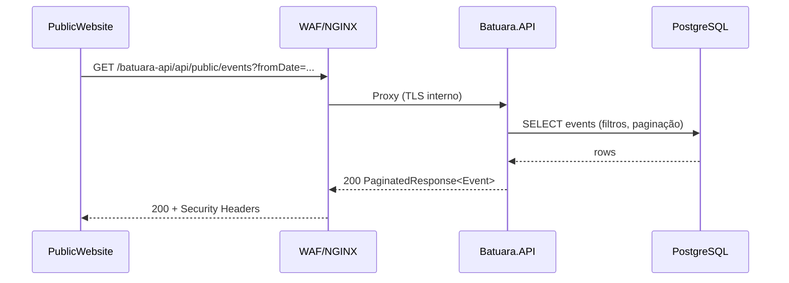
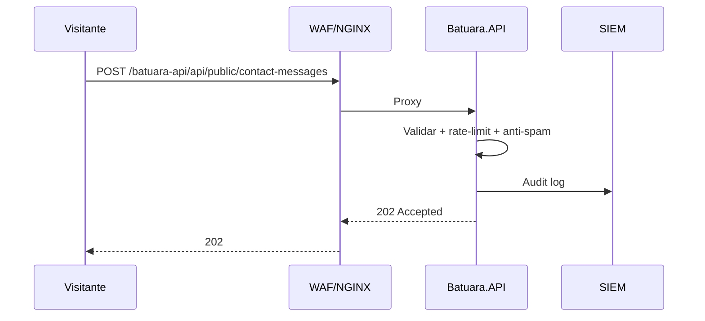
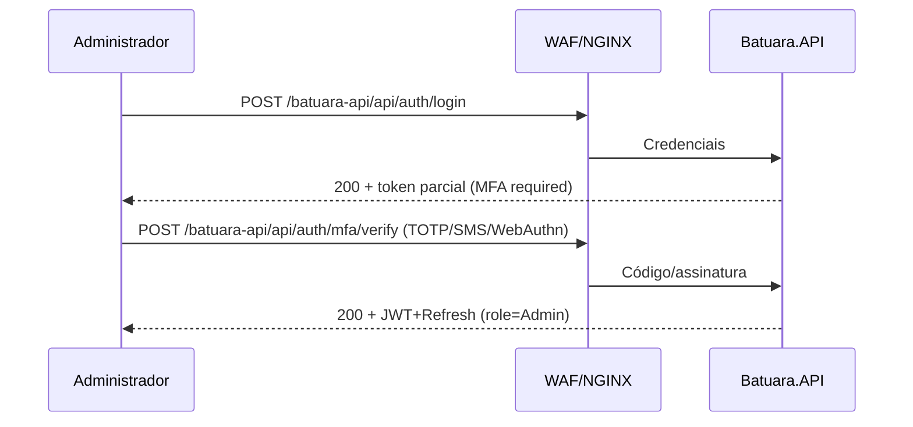

# Especificação Funcional Técnica (EFT) — Batuara.net

## 1. Visão Geral e Objetivos

- Padronizar e publicar APIs REST sob o prefixo obrigatório `/batuara-api` para suportar o PublicWebsite e o AdminDashboard.
- Garantir segurança em profundidade (MFA, RBAC, rate limiting, WAF, SIEM e pentests em pipeline).
- Cumprir SLAs: 95% das requisições ≤ 200ms; 99% ≤ 400ms; throughput efetivo alvo ≥ 1000 req/s (no edge), com escalabilidade horizontal.


## 2. Arquitetura do Sistema

### 2.1 Componentes

- Edge/Proxy: Nginx com TLS 1.3, gzip/br, cache estático, headers de segurança (CSP, HSTS, XFO, XCTO) e reverse proxy.
- Batuara.API (.NET 8): PathBase “/batuara-api”; Serilog estruturado; RateLimiter; EF Core (PostgreSQL).
- PublicWebsite (React 19 + MUI 7): SPA estática servida via Nginx.
- AdminDashboard (React 19 + MUI 7): SPA estática servida via Nginx, consome `/batuara-api/api/...`.
- Banco de Dados: PostgreSQL (OCI/Container), criptografia em repouso, usuários e privilégios mínimos.
- Observabilidade/SIEM: Serilog JSON + correlação; envio para SIEM (OCI Logging/Splunk/ELK).
- WAF (OCI): Regras para SQLi/XSS/bots; integração com LB público.

### 2.2 Deployment/Infraestrutura (OCI)

- Internet → LB público (OCI) → WAF (OCI) → Nginx (VM/Container) →
  - Static (Public/Admin) servidos via Nginx
  - Batuara.API em container
  - PostgreSQL em subnet privada (ou serviço gerenciado), snapshots/backup
- Segredos: OCI Vault (JWT secret, DB credentials, MFA providers). Proibido em código.
- Health check: `/batuara-api/health` com status do PostgreSQL e aplicação.

### 2.3 Diagramas de Componentes e Sequência

```mermaid
flowchart LR
  U[Usuário/Administrador] -->|HTTPS TLS 1.3| LB[OCI LB]
  LB --> WAF[OCI WAF]
  WAF --> NGINX[Nginx Reverse Proxy]
  NGINX -->|/batuara-public| PUBLIC[PublicWebsite (static)]
  NGINX -->|/batuara-admin| ADMIN[AdminDashboard (static)]
  NGINX -->|/batuara-api| API[Batuara.API (.NET 8)]
  API --> PG[(PostgreSQL)]
  API --> SIEM[SIEM/Logs]
```

Listar eventos (público)



Envio de contato (público)



Login admin com MFA




## 3. Modelos de Dados

### 3.1 Entidades (ER conceitual resumido)

- Event(id, title[1..200], description[1..2000], type{Festa,Evento,Celebracao,Bazar,Palestra}, location?, imageUrl?, isActive, createdAt, updatedAt)
  - EventDate(date: YYYY-MM-DD, startTime?: HH:mm, endTime?: HH:mm; start<end)
- CalendarAttendance(id, date, startTime, endTime, type{Kardecismo,Umbanda,Palestra,Curso}, description?, observations?, requiresRegistration, maxCapacity?, isActive, createdAt, updatedAt)
- Orixa(id, name, description, origin, batuaraTeaching, displayOrder, imageUrl?, colors[], elements[], characteristics[], isActive, createdAt, updatedAt)
- UmbandaLine(id, name, description, characteristics, batuaraInterpretation, displayOrder, entities[], workingDays[], isActive, createdAt, updatedAt)
- SpiritualContent(id, title, content[1..10000], type{Prayer,Teaching,Doctrine,Hymn,Ritual}, category{Umbanda,Kardecismo,General,Orixas}, source, displayOrder, isFeatured, isActive, createdAt, updatedAt)
- ContactMessage(id, name, email, phone?, subject, message, createdAt, status{New, Reviewed, Closed})
- Registration(id, attendanceId, name, email, phone?, createdAt, status{Created, Confirmed, Cancelled})
- AuditLog(id, userId?, action, entityType, entityId, timestamp, details, ip, userAgent)

### 3.2 Dicionário de Dados (amostra)

- Event.title: obrigatório, string máx 200
- Event.description: obrigatório, string máx 2000
- Event.type: enum string
- EventDate.date: obrigatório, formato ISO YYYY-MM-DD
- EventDate.startTime/endTime: HH:mm, quando ambos presentes start<end
- Attendance.maxCapacity: inteiro > 0 (opcional)
- SpiritualContent.content: obrigatório; sanitizado contra XSS; máx 10000


## 4. Fluxos de Integração e Mapeamento de Endpoints

### 4.1 Convenções

- Base: todas as rotas sob o prefixo `/batuara-api`.
- Público: `/api/public/...` (somente leitura + ações específicas).
- Admin: `/api/...` (CRUD; exige JWT + RBAC/MFA).
- Paginação: `pageNumber`, `pageSize`; busca `q`; ordenação `sort=campo:asc|desc`.

### 4.2 Endpoints (resumo)

- Events
  - Público: `GET /api/public/events`, `GET /api/public/events/{id}`
  - Admin: `GET/POST/PUT/PATCH/DELETE /api/events...`
- Calendar/Attendances
  - Público: `GET /api/public/calendar/attendances`, `GET /api/public/calendar/attendances/{id}`
  - Ação pública: `POST /api/public/calendar/attendances/{id}/registrations`
  - Admin: CRUD completo em `/api/calendar/attendances`
- Orixás
  - Público: `GET /api/public/orixas`, `GET /api/public/orixas/{id}`
  - Admin: CRUD completo em `/api/orixas`
- Linhas da Umbanda
  - Público: `GET /api/public/umbanda-lines`, `GET /api/public/umbanda-lines/{id}`
  - Admin: CRUD completo em `/api/umbanda-lines`
- Conteúdos Espirituais
  - Público: `GET /api/public/spiritual-contents`, `GET /api/public/spiritual-contents/{id}`
  - Admin: CRUD completo em `/api/spiritual-contents`
- Site Settings/Institucional
  - Público: `GET /api/public/site-settings` (hero, sobre, contato, doações, localização)
  - Admin: `GET/PUT/PATCH /api/site-settings`
- Contato
  - Público: `POST /api/public/contact-messages` (202 Accepted; rate limit)
- Dashboard
  - Admin: `GET /api/dashboard/stats`, `GET /api/dashboard/activity-logs`

### 4.3 Contratos (OpenAPI 3.0 — trecho)

```yaml
openapi: 3.0.3
info:
  title: Batuara API
  version: "1.0.0"
servers:
  - url: /batuara-api
components:
  securitySchemes:
    BearerAuth:
      type: http
      scheme: bearer
      bearerFormat: JWT
  schemas:
    ApiResponse:
      type: object
      properties:
        success: { type: boolean }
        data: {}
        message: { type: string, nullable: true }
        traceId: { type: string, nullable: true }
    PaginatedResponse:
      type: object
      properties:
        data: { type: array, items: {} }
        totalCount: { type: integer }
        pageNumber: { type: integer }
        pageSize: { type: integer }
        totalPages: { type: integer }
    Event:
      type: object
      properties:
        id: { type: integer }
        title: { type: string }
        description: { type: string }
        date: { type: string, format: date }
        startTime: { type: string, nullable: true }
        endTime: { type: string, nullable: true }
        type: { type: string, enum: [Festa, Evento, Celebracao, Bazar, Palestra] }
        location: { type: string, nullable: true }
        imageUrl: { type: string, nullable: true }
        isActive: { type: boolean }
paths:
  /api/public/events:
    get:
      summary: Listar eventos públicos
      parameters:
        - in: query
          name: q
          schema: { type: string }
        - in: query
          name: type
          schema: { type: string, enum: [Festa, Evento, Celebracao, Bazar, Palestra] }
        - in: query
          name: fromDate
          schema: { type: string, format: date }
        - in: query
          name: toDate
          schema: { type: string, format: date }
        - in: query
          name: pageNumber
          schema: { type: integer, default: 1 }
        - in: query
          name: pageSize
          schema: { type: integer, default: 20 }
        - in: query
          name: sort
          schema: { type: string, example: "date:asc" }
      responses:
        "200":
          description: OK
  /api/public/events/{id}:
    get:
      summary: Obter evento público por id
      parameters:
        - in: path
          name: id
          required: true
          schema: { type: integer }
      responses:
        "200": { description: OK }
        "404": { description: Not Found }
```


## 5. Requisitos de Performance (SLAs) e Estratégias

- SLAs
  - 95% ≤ 200ms; 99% ≤ 400ms para GETs públicos cacheáveis.
  - Throughput ≥ 1000 req/s no edge (Nginx + WAF + cache).
- Estratégias
  - Cache: Nginx estático + ETag/If-None-Match em GETs públicos de conteúdo estável.
  - Banco: índices por data/tipo; consultas projetadas; AsNoTracking; pooling.
  - API: DTOs “card” em listagens; compressão; paginação/filtragem/ordenação; JSON enxuto.
  - Infra: autoscaling (HPA), readiness/liveness, warmup.
  - Observabilidade: logs estruturados com traceId; métricas de latência/taxa de erro.


## 6. Segurança (Conforme prompt-security.md)

- Autenticação e MFA
  - Admin com MFA TOTP (RFC 6238), fallback SMS; suporte futuro a WebAuthn/biometria.
- Autorização RBAC por endpoint
  - Roles: Admin, Moderator, Editor; policies finas por rota e operação.
- Rate Limiting
  - IP: 100 req/h para rotas públicas.
  - Token: 1000 req/h para autenticados.
  - Políticas distintas para `/auth`, `/api/public` e `/api`.
- Validações OWASP Top 10
  - DTOs com FluentValidation; sanitização/encoding de campos ricos; size limits.
  - IDOR: checagens de ownership/escopo antes de GET/PUT/PATCH/DELETE sensíveis.
  - Race conditions: transações atômicas em contadores/capacidade.
- Criptografia
  - Trânsito: TLS 1.3 end-to-end (mTLS interno opcional).
  - Repouso: disk encryption/TDE; segredos em Vault; hash/salt para senhas; AES-256 para dados sensíveis quando aplicável.
- Headers de segurança
  - CSP, HSTS, X-Frame-Options, X-Content-Type-Options configurados em Nginx/API.
- Auditoria e SIEM
  - Serilog JSON com `traceId`, `userId`, `ip`, `userAgent`; envio para SIEM; alertas.
- WAF (OCI)
  - Regras para SQLi/XSS; bot management; proteção IP direto.
- Swagger
  - Restringido em produção (behind-auth/role Admin). Jamais expor a anônimos.
- Segredos
  - Nunca em repositório; somente variáveis de ambiente/OCI Vault.


## 7. Governança, Qualidade e Validações

- Documentação OpenAPI 3.0 atualizada por domínio; exemplos de request/response.
- Testes: unit (≥80% Domain/Application), integração (API+DB), desempenho (k6), segurança (ZAP baseline).
- Pipeline CI/CD: SAST, DAST, dependency scanning, pentest automatizado por commit.
- Revisões obrigatórias: pares + stakeholders a cada 3 dias; gate de aprovação por fase.


## 8. Cronograma de Alto Nível (10 dias úteis)

- D0–D2: Contratos, OpenAPI, DTOs, rate limiting básico, políticas de acesso e revisão do Swagger em produção.
- D3: Revisão 1 e ajustes.
- D4–D6: Domínios núcleo (SiteSettings, Events, Contact).
- D6: Revisão 2; smoke tests staging (SLA/segurança).
- D7–D9: Orixás, UmbandaLines, SpiritualContents + Calendar (P1) + Dashboard/Auditoria.
- D9: Revisão 3; testes de desempenho/segurança.
- D10: MFA/RBAC granular, WAF/SIEM, hardening avançado; aprovação final e go/no-go.

> **Nota:** Segurança avançada (MFA TOTP, RBAC granular, WAF/SIEM) foi movida para o final (Bloco 6.4) conforme ordem de execução otimizada no ROADMAP.md. A fundação técnica (D0–D2) inclui rate limiting básico e políticas de acesso, mas não MFA/RBAC granular.

