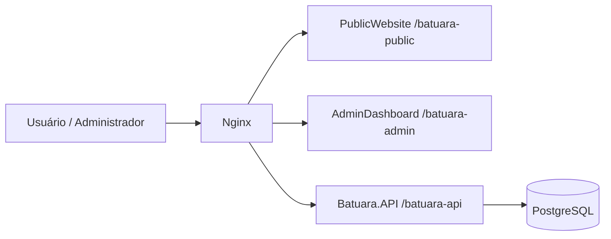
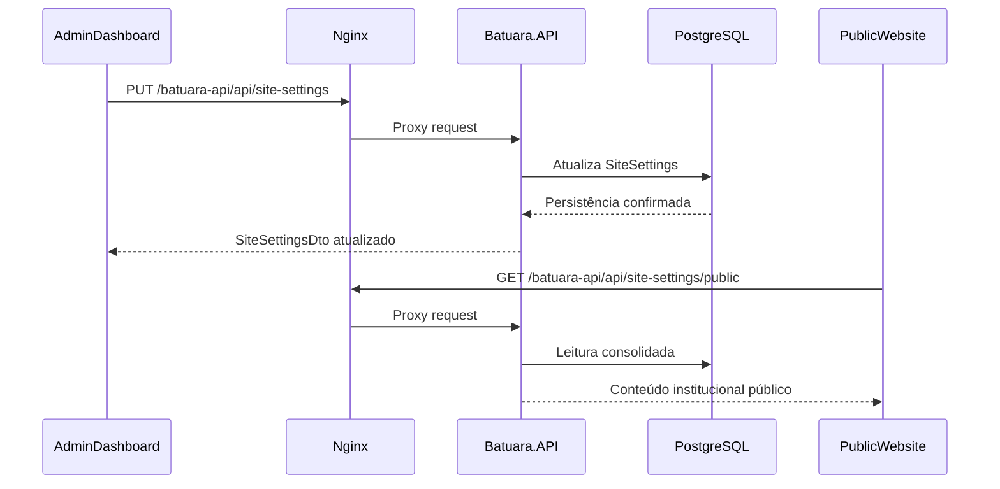

# Especificação Funcional Técnica (EFT) — Batuara.net

**Versão do documento:** 2026.04.03  
**Status:** Atualizado para refletir a implementação corrente em disco  
**Escopo:** PublicWebsite, AdminDashboard, Batuara.API, PostgreSQL, Nginx local/OCI

## 1. Visão Geral

O Batuara.net é um monorepo que entrega:

- **PublicWebsite** para divulgação institucional, calendário, conteúdo espiritual, doações, localização e contato
- **AdminDashboard** para gestão operacional e editorial
- **Batuara.API** em .NET 8 para autenticação, CMS, integrações e persistência
- **PostgreSQL** como banco relacional principal
- **Nginx** como reverse proxy local e de produção

Os objetivos técnicos atuais são:

- Consolidar a base `/batuara-api` para todos os acessos HTTP da API
- Manter os dois frontends desacoplados, consumindo contratos REST padronizados
- Centralizar conteúdo institucional em `SiteSettings`
- Garantir rastreabilidade, validação e implantação consistente em ambiente local e OCI

## 2. Arquitetura Atual

### 2.1 Componentes

- **Nginx** publica `/batuara-public/`, `/batuara-admin/` e `/batuara-api/`
- **Batuara.API** usa `UsePathBase("/batuara-api")`, autenticação JWT, Serilog, EF Core e health checks
- **PublicWebsite** usa React 19, MUI 7 e TanStack Query
- **AdminDashboard** usa React 19, MUI 7, TanStack Query e fluxos CRUD por módulo
- **PostgreSQL** persiste usuários, conteúdo, calendário, eventos, Orixás, mensagens e configurações institucionais

### 2.2 Diagrama de Componentes



### 2.3 Fluxo Principal de Conteúdo Institucional



## 3. Módulos Implementados

### 3.1 Funcionalidades Entregues

| Módulo | Estado | Detalhes |
|---|---|---|
| Autenticação | Implementado | Login, refresh, logout, perfil, alteração de senha, verificação de token |
| SiteSettings | Implementado | História, missão, contato, localização, redes sociais, PIX e dados bancários |
| Calendário | Implementado | CRUD admin e leitura pública com filtros por data/tipo |
| Eventos | Implementado | CRUD admin, leitura pública e regras de domínio |
| Orixás | Implementado | CRUD admin e catálogo público |
| Guias e Entidades | Implementado | CRUD admin e leitura pública |
| Linhas da Umbanda | Implementado | CRUD admin e leitura pública |
| Conteúdos Espirituais | Implementado | CRUD admin e leitura pública |
| Filhos da Casa | Implementado | CRUD admin com integração ao dashboard |
| Contato Público | Implementado | Recebimento de mensagens públicas |

### 3.2 Mudanças Recentes Relevantes

- A seção **Nossa História** no AdminDashboard foi simplificada para **edição textual em tela cheia**
- O suporte a **imagem e vídeo da história** foi removido do frontend, backend e banco
- `SiteSettings` passou a ser a fonte oficial de:
  - história institucional
  - missão
  - endereço
  - e-mail institucional
  - telefones
  - redes sociais
  - mapa incorporado
  - PIX e dados bancários
- A seção pública de **Localização** e o **rodapé** passaram a refletir diretamente os dados de `site-settings/public`
- O **Calendário público** foi simplificado visualmente, inclusive com remoção do badge numérico por dia

## 4. Endpoints e Integrações

### 4.1 Convenções

- Prefixo da API: `/batuara-api`
- Rotas reais expostas: `/batuara-api/api/...`
- Rotas públicas: `/batuara-api/api/public/...`
- Rotas administrativas: `/batuara-api/api/...`
- Alguns controllers também expõem aliases versionados `/api/v1/...`

### 4.2 Endpoints Principais

| Domínio | Endpoints |
|---|---|
| Auth | `POST /auth/login`, `POST /auth/refresh`, `POST /auth/logout`, `GET /auth/me`, `PUT /auth/me`, `PUT /auth/change-password`, `GET /auth/verify` |
| SiteSettings | `GET /site-settings/public`, `GET /site-settings`, `PUT /site-settings` |
| Calendário Público | `GET /public/calendar/attendances`, `GET /public/calendar/attendances/{id}` |
| Calendário Admin | `GET/POST /calendar/attendances`, `GET/PUT/DELETE /calendar/attendances/{id}` |
| Eventos Públicos | `GET /public/events`, `GET /public/events/{id}` |
| Eventos Admin | `GET/POST /events`, `GET/PUT/DELETE /events/{id}` |
| Orixás | `GET /public/orixas`, `GET /public/orixas/{id}`, `GET/POST/PUT/DELETE /orixas` |
| Guias | `GET /public/guides`, `GET /public/guides/{id}`, `GET/POST/PUT/DELETE /guides` |
| Linhas da Umbanda | `GET /public/umbanda-lines`, `GET /public/umbanda-lines/{id}`, `GET/POST/PUT/DELETE /umbanda-lines` |
| Conteúdos Espirituais | `GET /public/spiritual-contents`, `GET /public/spiritual-contents/{id}`, `GET/POST/PUT/DELETE /spiritual-contents` |
| Filhos da Casa | `GET/POST/PUT/DELETE /house-members` |
| Contato Público | `POST /public/contact-messages` |

### 4.3 Integrações Entre Componentes

- **PublicWebsite → API**
  - calendário público
  - eventos públicos
  - Orixás, Guias, Linhas e Conteúdos
  - `site-settings/public`
- **AdminDashboard → API**
  - autenticação
  - CMS institucional
  - CRUD de domínio
  - gestão de perfil
- **API → PostgreSQL**
  - EF Core migrations
  - leituras públicas projetadas
  - atualizações administrativas parciais

### 4.4 Exemplos de Uso

```bash
curl http://localhost/batuara-api/health
```

```bash
curl http://localhost/batuara-api/api/site-settings/public
```

```bash
curl -X POST http://localhost/batuara-api/api/auth/login \
  -H "Content-Type: application/json" \
  -d "{\"email\":\"admin@batuara.org.br\",\"password\":\"Admin123!\"}"
```

## 5. Modelo de Dados

### 5.1 Entidades Principais

- `User`
- `RefreshToken`
- `Event`
- `CalendarAttendance`
- `Orixa`
- `Guide`
- `UmbandaLine`
- `SpiritualContent`
- `HouseMember`
- `HouseMemberContribution`
- `ContactMessage`
- `SiteSettings`

### 5.2 Evolução Recente do Schema

| Migration | Mudança |
|---|---|
| `20260401234426_AddSiteSettings` | criação inicial de `SiteSettings` |
| `20260402235355_ContentManagementModules` | expansão de `SiteSettings`, criação de `ContactMessages`, `Guides`, `HouseMembers` e `HouseMemberContributions` |
| `20260403014603_AddHistoryMissionTextToSiteSettings` | inclusão de `HistoryMissionText` |
| `20260403043437_RemoveHistoryMediaFromSiteSettings` | remoção de `HistoryImageUrl` e `HistoryVideoUrl` |

### 5.3 Estrutura Atual de `SiteSettings`

`SiteSettings` hoje cobre:

- `HistoryTitle`
- `HistorySubtitle`
- `HistoryHtml`
- `HistoryMissionText`
- `AboutText`
- `InstitutionalEmail`
- `PrimaryPhone`, `SecondaryPhone`, `WhatsappNumber`
- `Street`, `Number`, `Complement`, `District`, `City`, `State`, `ZipCode`
- `ReferenceNotes`, `MapEmbedUrl`
- `FacebookUrl`, `InstagramUrl`, `YoutubeUrl`, `WhatsappUrl`
- `PixKey`, `BankName`, `BankAgency`, `BankAccount`, `BankAccountType`, `CompanyDocument`

## 6. Requisitos Funcionais e Regras Técnicas

### 6.1 SiteSettings / Nossa História

- O AdminDashboard salva história institucional via `PUT /site-settings`
- O editor padrão trabalha com:
  - título
  - subtítulo
  - missão
  - HTML rico
  - texto simplificado
- O sistema aplica fallback para título e conteúdo padrão quando necessário
- A história **não possui mais** campos de imagem nem vídeo

### 6.2 Localização e Contato

- O endereço público é montado a partir dos campos estruturados
- O rodapé e a seção de localização consomem o DTO público consolidado
- Há normalização/fallback para mapa, Instagram e dados institucionais

### 6.3 Calendário

- O admin permite CRUD completo de atendimentos
- O público lê somente itens ativos
- O frontend público foca o mês corrente e não exibe mais badge de quantidade diária

## 7. Configuração, Ambientes e Deploy

### 7.1 Requisitos de Ambiente

- .NET 8 SDK
- Node.js 20+ recomendado
- Docker Desktop / Docker Compose
- PostgreSQL 15+ no ambiente local containerizado

### 7.2 Variáveis Críticas

| Variável | Uso |
|---|---|
| `DB_PASSWORD` | senha do PostgreSQL |
| `JWT_SECRET` | assinatura de tokens JWT |
| `ENVIRONMENT` | ambiente ASP.NET |
| `REACT_APP_API_URL_PUBLIC` | base da API para o PublicWebsite |
| `REACT_APP_API_URL_ADMIN` | base da API para o AdminDashboard |

### 7.3 Deploy Local

Procedimento padrão:

```bash
$env:DB_PASSWORD='...'
$env:JWT_SECRET='...'
docker compose -p batuara-net-local -f docker-compose.local.yml up -d --build api publicwebsite admindashboard nginx
```

### 7.4 Observação Operacional Importante

Após rebuilds completos, o `nginx` local pode manter upstreams antigos e causar `502 Bad Gateway`.  
Quando isso ocorrer, recriar explicitamente o proxy resolve o problema:

```bash
$env:DB_PASSWORD='...'
$env:JWT_SECRET='...'
docker compose -p batuara-net-local -f docker-compose.local.yml up -d --force-recreate nginx
```

## 8. Dependências e Qualidade

### 8.1 Dependências Técnicas

- ASP.NET Core 8
- Entity Framework Core 8
- PostgreSQL
- Serilog
- FluentValidation
- React 19
- Material UI 7
- TanStack Query 5
- Axios
- date-fns 4
- Nginx
- Docker Compose

### 8.2 Estratégia de Validação

- `dotnet build` para a solução backend
- `dotnet test` para testes de infraestrutura e regras
- `npm run build` para cada frontend
- smoke tests HTTP em:
  - `/batuara-api/health`
  - `/batuara-api/swagger`
  - `/batuara-public/`
  - `/batuara-admin/`

## 9. Onboarding e Contribuição

### 9.1 Setup Rápido

1. Definir `DB_PASSWORD` e `JWT_SECRET`
2. Subir a stack local com Docker Compose
3. Validar `health`, `swagger`, site público e admin
4. Fazer login com usuário admin seedado
5. Conferir documentação complementar:
   - `docs/Resumo-Executivo.md`
   - `docs/STATUS-PROJETO.md`
   - `docs/Backlog-Executavel.md`
   - `agent.md`

### 9.2 Diretrizes de Contribuição

- Alterações funcionais devem atualizar documentação e, quando aplicável, migrations
- Mudanças em contratos públicos devem refletir o OpenAPI/Swagger
- Qualquer ajuste em `SiteSettings` precisa considerar:
  - AdminDashboard
  - PublicWebsite
  - DTOs da API
  - migrations/validators
  - fallback de conteúdo

## 10. Change Log do Documento

### 2026.04.03

- Alinhada a arquitetura real do monorepo
- Atualizados endpoints públicos e administrativos em uso
- Registradas as migrations recentes de `SiteSettings`
- Documentada a remoção de mídia da seção Nossa História
- Documentadas as integrações de localização/rodapé e calendário público
- Adicionado procedimento operacional para recriação do `nginx` local após rebuilds

