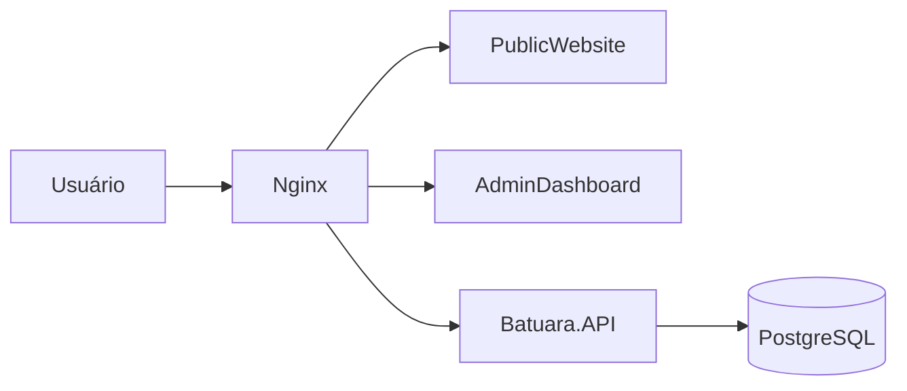

# Resumo Executivo — Batuara.net

**Versão do documento:** 2026.04.03  
**Status:** Atualizado conforme a implementação corrente  
**Público-alvo:** stakeholders, liderança técnica, onboarding executivo

## 1. Visão Geral

O Batuara.net está operando como uma plataforma web com três pilares:

- **Batuara.API** em .NET 8
- **PublicWebsite** em React 19 + MUI 7
- **AdminDashboard** em React 19 + MUI 7

O projeto já possui autenticação funcional, módulos de conteúdo, calendário, eventos, Orixás, Guias, Linhas da Umbanda, conteúdos espirituais, Filhos da Casa, localização, doações institucionais e mensagens de contato.

## 2. Resumo do Estado Atual

### 2.1 Entregas Já Implementadas

- API REST publicada sob `/batuara-api`
- Reverse proxy local/produtivo com Nginx
- CRUD administrativo de:
  - eventos
  - calendário
  - Orixás
  - Guias e Entidades
  - Linhas da Umbanda
  - conteúdos espirituais
  - Filhos da Casa
  - configurações institucionais
- Experiência pública consumindo dados reais da API
- Swagger e health check operacionais em ambiente local

### 2.2 Mudanças Recentes de Maior Impacto

- **Centralização institucional em `SiteSettings`**
  - história
  - missão
  - contato
  - localização
  - redes sociais
  - PIX e dados bancários
- **Seção “Nossa História” simplificada no AdminDashboard**
  - editor textual em tela cheia
  - remoção de preview dividido
  - remoção de imagem e vídeo
  - conteúdo padrão institucional atualizado
- **Ajustes no PublicWebsite**
  - localização e rodapé alinhados aos dados da API pública
  - calendário público simplificado, sem badge numérico diário

## 3. Destaques Técnicos

### 3.1 Endpoints Estratégicos

- `GET /batuara-api/health`
- `GET /batuara-api/swagger`
- `POST /batuara-api/api/auth/login`
- `GET /batuara-api/api/site-settings/public`
- `PUT /batuara-api/api/site-settings`
- `GET /batuara-api/api/public/calendar/attendances`
- `GET/POST /batuara-api/api/events`

### 3.2 Alterações de Banco de Dados

As últimas mudanças estruturais relevantes foram:

- criação e expansão de `SiteSettings`
- criação de `ContactMessages`
- criação de `Guides`
- criação de `HouseMembers`
- criação de `HouseMemberContributions`
- inclusão de `HistoryMissionText`
- remoção de `HistoryImageUrl` e `HistoryVideoUrl`

## 4. Arquitetura e Integrações



### 4.1 Pontos de Integração

- **AdminDashboard ↔ API:** autenticação, CMS e CRUDs
- **PublicWebsite ↔ API:** conteúdo institucional, agenda e conteúdo espiritual
- **API ↔ PostgreSQL:** persistência relacional e migrations
- **Nginx ↔ serviços internos:** roteamento por path base

## 5. Dependências e Configuração

### 5.1 Dependências-Chave

- .NET 8
- React 19
- Material UI 7
- TanStack Query 5
- PostgreSQL
- Docker Compose
- Nginx

### 5.2 Variáveis Críticas

- `DB_PASSWORD`
- `JWT_SECRET`
- `REACT_APP_API_URL_PUBLIC`
- `REACT_APP_API_URL_ADMIN`
- `ENVIRONMENT`

## 6. Deploy e Operação

### 6.1 Procedimento Local

```bash
$env:DB_PASSWORD='...'
$env:JWT_SECRET='...'
docker compose -p batuara-net-local -f docker-compose.local.yml up -d --build api publicwebsite admindashboard nginx
```

### 6.2 Observação Operacional

Quando containers são recriados, o `nginx` local pode manter upstreams desatualizados.  
Nesses casos, o procedimento operacional correto é:

```bash
$env:DB_PASSWORD='...'
$env:JWT_SECRET='...'
docker compose -p batuara-net-local -f docker-compose.local.yml up -d --force-recreate nginx
```

## 7. Benefícios Atuais

- **Menor retrabalho** entre frontend e backend por contratos centralizados
- **Melhor governança de conteúdo** via `SiteSettings`
- **Onboarding técnico mais rápido** com estrutura clara de rotas, docs e deploy
- **Operação local mais previsível** com stack Docker padronizada

## 8. Riscos e Atenções

- Ainda existe documentação histórica que citava mídia em “Nossa História”; isso exigiu atualização cruzada
- Mudanças em `SiteSettings` impactam simultaneamente:
  - DTOs
  - validators
  - telas admin
  - seções públicas
  - migrations
- Rebuilds locais podem exigir recriação do `nginx`

## 9. Uso e Referências

### 9.1 Verificação Rápida

```bash
curl http://localhost/batuara-api/health
curl http://localhost/batuara-api/swagger
curl http://localhost/batuara-public/
curl http://localhost/batuara-admin/
```

### 9.2 Referências Cruzadas

- `docs/EFT-especificacao-funcional-tecnica.md`
- `docs/STATUS-PROJETO.md`
- `docs/Backlog-Executavel.md`
- `docs/TASK_HISTORY.md`
- `agent.md`

## 10. Change Log

### 2026.04.03

- Atualizado para refletir a arquitetura real em produção e ambiente local
- Incluídas mudanças recentes de `SiteSettings` e da seção “Nossa História”
- Incluídas mudanças de schema e observações operacionais de deploy local
- Ajustadas integrações, dependências e referências para onboarding executivo

